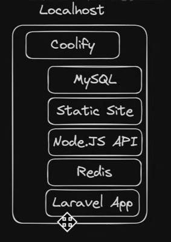
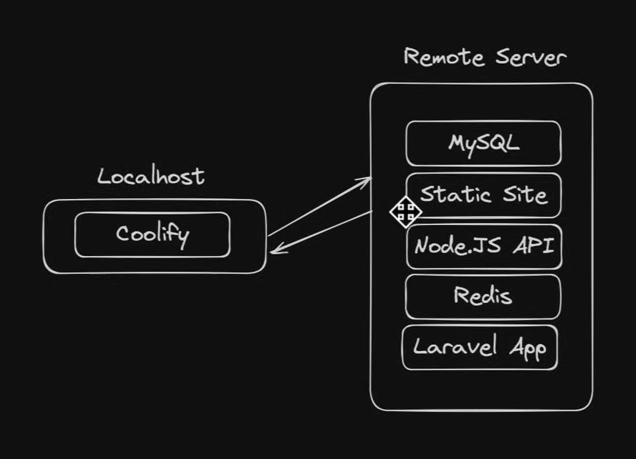
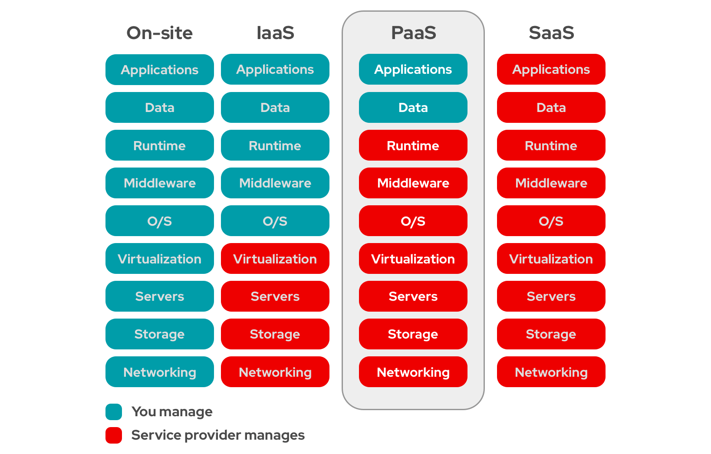

# Coolify vs Vercel

| Feature               | Vercel                          | Coolify                              |
|-----------------------|---------------------------------|--------------------------------------|
| **Type**              | Deployment Platform              | Self-Hosted Management               |
| **Deployment**        | Automatic from Git               | Manual or automatic (via Docker or git)     |
| **Environment**       | Serverless                    | Self-hosted on your server           |
| **Scalability**       | Auto-scaling                     | Scales with your server resources    |
| **Custom Domains**    | Free with SSL                    | Fully customizable with your server  |
| **Features**          | CI/CD, Analytics, Serverless     | Comprehensive app & database management |
| **Pricing**           | Free tier; paid plans available  | Free; only server hosting costs apply |
| **Ease of Use**       | User-friendly                    | Full control with robust configuration |


 



## Why Coolify Might Be Your Best Bet

1. **Save Big on Costs**:
   - **Coolify**: If you’re looking to save some serious cash, Coolify is where it’s at. By hosting it yourself, you could save up to 90% compared to Vercel. Plus, you can often find a free or super cheap VPS to get started.
   - **Vercel**: It’s fantastic for ease of use, but as your project grows, so do the costs. It can get pretty pricey, especially if you’re scaling up.

2. **Complete Control**:
   - **Coolify**: With Coolify, you’re in the driver’s seat. You get full control over your code, data, and server setup. No more being tied to someone else’s platform limitations!
   - **Vercel**: It’s great for quick deployments, but you’re somewhat limited by their platform’s constraints. Customizing and controlling everything can be a bit restrictive.

3. **Flexibility and Integration**:
   - **Coolify**: It’s got you covered with support for various languages and frameworks. Plus, you get built-in Git integration, SSL management, and even database backups—all in one place.
   - **Vercel**: Perfect for frontend projects and works seamlessly with Next.js, but for backend needs and databases, you’ll need to look at other services.

4. **Manage Your Resources**:
   - **Coolify**: Efficiently manage your server and resources, and set up things like databases right from the Coolify dashboard. It’s all about giving you the tools to handle everything yourself.
   - **Vercel**: Focuses mainly on the frontend. For backend services and databases, you’ll need to integrate additional tools and services.

5. **Customization Galore**:
   - **Coolify**: Love tweaking and customizing? Coolify lets you configure everything just the way you like it. It’s ideal if you’re into self-hosting and want full control.
   - **Vercel**: While it’s streamlined and user-friendly, it doesn’t offer as much flexibility when it comes to backend and server tweaks.


# Installing Coolify

## Requirements
- **Server**: VPS, Raspberry Pi, or similar (Cloud Provider is recommended)
- **OS**: Debian, Ubuntu, CentOS, Fedora, RedHat, SUSE, Arch Linux, Raspberry Pi OS
- **Minimum Specs**: 2 CPUs, 2 GB RAM, 30 GB storage

### Recommended Instances for Coolify

| Cloud Provider | Instance Type       | CPU    | RAM   | Storage                |
|----------------|----------------------|--------|-------|------------------------|
| **AWS**        | t3.medium            | 2 vCPUs| 8 GB  | EBS Storage (Elastic)  |
| **Azure**      | B2ms                 | 2 vCPUs| 8 GB  | Standard SSD           |
| **Google Cloud**| n1-standard-2        | 2 vCPUs| 7.5 GB| Persistent Disk (Standard) |
| **DigitalOcean**| s-1vcpu-1gb          | 1 vCPU | 1 GB  | 25 GB SSD              |
| **Hetzner**    | CX21                 | 2 vCPUs| 8 GB  | 160 GB SSD             |
| **Linode**     | Nanode 2GB           | 1 vCPU | 2 GB  | 50 GB SSD              |

## Tip

If you don’t have a server or server provider yet, Coolify recommend you to use ``Hetzner``.

[Hetzner Link](https://coolify.io/hetzner)

## Automated Installation
1. **Root User**: You must login as root user to be able to download coolify.
```bash
sudo -i
```
2. **Curl Installed**: Check `curl` command.
```bash
curl --version
```
3. **Run Script**:
```bash
curl -fsSL https://cdn.coollabs.io/coolify/install.sh | bash
```

## Common Bug 

- Ensure You ``reset Coolify-generated labels`` after editing the domain name .

# Adding a Domain in Coolify

After obtaining your domain, follow these steps to add it in Coolify:

1. **Access Coolify Settings**:
   - Log in to your Coolify admin interface.

2. **Add Domain**:
   - Go to the **Settings** section.
   - Locate the domain settings area and enter your domain name as `https://domain-name`.

3. **Adjust DNS Validation**:
   - Uncheck the **Validate DNS Settings** option. This adjustment is necessary if you encounter issues with DNS validation.
   - Also uncheck auto update coolify "Recommended"
4. **Save Changes**:
   - Save your settings to apply the new domain configuration.


5. **Go to Servers & Switch to Caddy Proxy** (recommended):
   - Go to your server and configure Caddy as the reverse proxy.

6. **Use Wildcard Domain**:
   - Ensure the wildcard domain is set up correctly.

7. **Check Dynamic Configuration**:
   - Verify that the dynamic configuration reflects the changes.

8. **Configure Fireware on your cloud instance**:
   - Ensure that only port ``443``,``22`` and port ``80`` is allowed . (For HTTP & HTTPS and SSH)

# Dynamic Configuration in Caddy UI: Redirect www to Original Domain ( Recommended for Best Practices )

To set up a global redirection from `www` to your main domain using Caddy's UI, follow these steps:

1. **Access Caddy Admin Interface**:
   - Open your Caddy admin interface in your web browser.

2. **Navigate to Dynamic Configuration**:
   - Go to the **Dynamic Configuration** section.

3. **Add a Global Redirect**:
   
   ```
   www.coolify.amir.com {
    redir https://coolify.amir.gdn{uri}
    }
   ```

[Caddy Documentation](Link)

## What is Nixpacks ? 

-  Coolify simplifies deployment with a one-click setup (You dont need to deel with docker containers), automating the build process using the Nix package manager. It ensures your application runs smoothly by managing all dependencies and configurations for you. Whether you're working with npm or other tools, Nixpacks makes deployment as easy as clicking a button, similar to how services like Railway streamline the process.